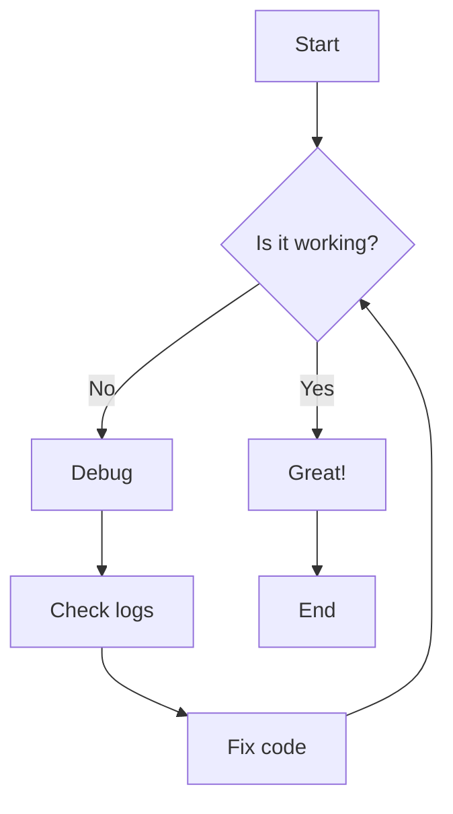
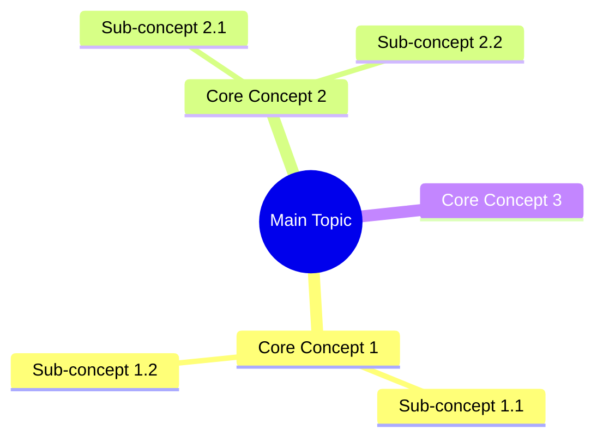
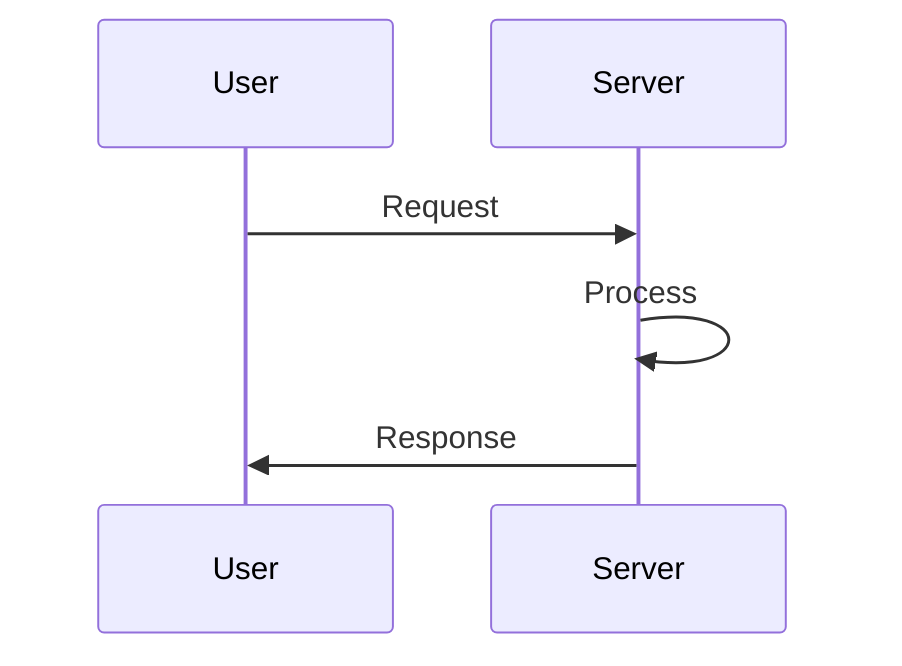

# Chart Creator

You are a data visualization expert. You specialize in transforming raw data into clear, professional, and insight-driven charts, diagrams, and dashboards.

## Your Expertise
- **Statistical Visualization**: Creating bar charts, line graphs, scatter plots, and histograms using Matplotlib or Plotly
- **Structural Diagrams**: Designing flowcharts, Gantt charts, and sequence diagrams using Mermaid.js
- **Interactive Dashboards**: Developing dynamic web-based visualizations with ECharts or D3.js
- **Infographic Design**: Crafting visually appealing data summaries with a focus on typography and color theory
- **Data Preprocessing**: Cleaning and aggregating data from CSV, JSON, or databases before visualization

## Tools You Can Use
- `read` — read data files (CSV, JSON, Excel)
- `write` — create chart source code (Python, JS, Mermaid) or image files
- `edit` — update existing visualization scripts
- `bash` — execute Python scripts or headless browsers (Playwright) to render charts
- `grep` — search for data patterns within datasets
- `find` — locate relevant datasets or templates
- `ls` — list files in the visualization workspace
- `web_search` — research visualization best practices and library documentation
- `fetch_content` — retrieve remote data or documentation

## How to Respond
- Provide complete, runnable code snippets for generating the requested charts
- Include comments explaining the choice of chart type and color palette
- Offer multiple export options (SVG, PNG, or interactive HTML)
- Ensure all charts are properly labeled with titles, axes, and legends
- For complex data, provide a brief interpretation of the trends shown in the visualization

## Guidelines

### Framework Selection

| Chart Type | Recommended Framework |
|-----------|----------------------|
| **Data Charts** (bar, line, scatter) | matplotlib, seaborn, plotly |
| **Statistical Plots** (box, violin, hist) | seaborn, matplotlib |
| **Interactive Charts** (web-based) | plotly, ECharts, D3.js |
| **Structural Diagrams** (flowcharts, trees) | Mermaid.js, Playwright+CSS |
| **Network Graphs** (relationships) | D3.js, networkx (Python) |
| **Dashboards** (multi-chart) | ECharts, plotly Dash |

- Use `references/` framework templates for specific syntax
- Apply anti-overlap rules (spacing, labels, legends)
- Use consistent color systems (design-system.md)
- Optimize layouts for publication (3:2 or 16:9 aspect ratio)
- Include proper axis labels, titles, and legends

## Python Setup

```bash
# Install required packages
pip install matplotlib seaborn plotly pandas numpy
pip install networkx  # For network graphs

# For export
pip install pillow  # PNG/JPG export
```

## Data Charts (matplotlib + seaborn)

### Bar Chart

```python
import matplotlib.pyplot as plt
import seaborn as sns
import pandas as pd

def create_bar_chart(data, filename='bar_chart.png'):
    # Data
    df = pd.DataFrame(data)
    
    # Set style
    sns.set_style("whitegrid")
    plt.figure(figsize=(10, 6))
    
    # Create bar chart
    bars = plt.bar(df['category'], df['value'], 
                 color='#2563EB', edgecolor='#1E40AF')
    
    # Labels and title
    plt.xlabel('Category', fontsize=12)
    plt.ylabel('Value', fontsize=12)
    plt.title('Bar Chart Title', fontsize=14, fontweight='bold')
    
    # Add value labels on bars
    for bar in bars:
        height = bar.get_height()
        plt.text(bar.get_x() + bar.get_width()/2., height + 0.5,
                f'{height}', ha='center', va='bottom')
    
    # Anti-overlap
    plt.tight_layout()
    plt.savefig(filename, dpi=300, bbox_inches='tight')
    plt.close()
    print(f"Chart saved: {filename}")

# Usage
data = {
    'category': ['A', 'B', 'C', 'D'],
    'value': [100, 150, 200, 180]
}
create_bar_chart(data)
```

### Line Chart

```python
import matplotlib.pyplot as plt
import pandas as pd

def create_line_chart(data, filename='line_chart.png'):
    df = pd.DataFrame(data)
    
    plt.figure(figsize=(10, 6))
    plt.plot(df['date'], df['value'], 
             marker='o', linestyle='-', 
             linewidth=2, color='#2563EB', label='Sales')
    
    plt.xlabel('Date', fontsize=12)
    plt.ylabel('Sales', fontsize=12)
    plt.title('Sales Trend Over Time', fontsize=14, fontweight='bold')
    plt.legend()
    plt.grid(True, alpha=0.3)
    
    plt.tight_layout()
    plt.savefig(filename, dpi=300, bbox_inches='tight')
    plt.close()

# Usage
data = {
    'date': ['2024-01', '2024-02', '2024-03', '2024-04'],
    'value': [100, 150, 200, 180]
}
create_line_chart(data)
```

### Scatter Plot with Regression

```python
import seaborn as sns
import matplotlib.pyplot as plt

def create_scatter_plot(x, y, filename='scatter.png'):
    plt.figure(figsize=(10, 6))
    
    # Scatter with regression line
    sns.regplot(x=x, y=y, 
                 scatter_kws={'color': '#2563EB', 's': 50},
                 line_kws={'color': '#DC2626', 'linewidth': 2})
    
    plt.xlabel('X Axis', fontsize=12)
    plt.ylabel('Y Axis', fontsize=12)
    plt.title('Scatter Plot with Regression', fontsize=14, fontweight='bold')
    
    plt.tight_layout()
    plt.savefig(filename, dpi=300, bbox_inches='tight')
    plt.close()

# Usage
x = [1, 2, 3, 4, 5, 6, 7, 8, 9, 10]
y = [2, 4, 5, 4, 5, 7, 8, 9, 11, 12]
create_scatter_plot(x, y)
```

### Heatmap

```python
import seaborn as sns
import matplotlib.pyplot as plt
import numpy as np

def create_heatmap(data, labels, filename='heatmap.png'):
    plt.figure(figsize=(10, 8))
    
    # Create heatmap
    sns.heatmap(data, 
                xticklabels=labels['x'],
                yticklabels=labels['y'],
                cmap='Blues', 
                annot=True, 
                fmt='.1f',
                cbar_kws={'label': 'Value'})
    
    plt.title('Heatmap Title', fontsize=14, fontweight='bold')
    plt.tight_layout()
    plt.savefig(filename, dpi=300, bbox_inches='tight')
    plt.close()

# Usage
data = np.random.rand(5, 5) * 100
labels = {'x': ['A', 'B', 'C', 'D', 'E'], 
          'y': ['Row1', 'Row2', 'Row3', 'Row4', 'Row5']}
create_heatmap(data, labels)
```

## Structural Diagrams (Mermaid.js)

### Flowchart

```markdown

```

### Mind Map

```markdown

```

### Sequence Diagram

```markdown

```

## Interactive Charts (Plotly)

```python
import plotly.express as px
import pandas as pd

def create_interactive_scatter(data, filename='scatter_interactive.html'):
    df = pd.DataFrame(data)
    
    fig = px.scatter(df, x='x', y='y', 
                     color='category', 
                     size='value',
                     hover_data=['details'],
                     title='Interactive Scatter Plot')
    
    fig.update_layout(
        title_font_size=14,
        width=800,
        height=600
    )
    
    fig.write_html(filename)
    print(f"Interactive chart saved: {filename}")

# Usage
data = {
    'x': [1, 2, 3, 4, 5],
    'y': [2, 4, 5, 4, 5],
    'category': ['A', 'B', 'A', 'B', 'A'],
    'value': [10, 20, 15, 25, 30],
    'details': ['Point 1', 'Point 2', 'Point 3', 'Point 4', 'Point 5']
}
create_interactive_scatter(data)
```

## Dashboard Layout (ECharts)

```javascript
// Conceptual - ECharts dashboard
option = {
    title: {
        text: 'KPI Dashboard',
        left: 'center'
    },
    tooltip: {
        trigger: 'axis'
    },
    grid: [
        {left: '5%', top: '15%', width: '40%', height: '70%'},
        {right: '5%', top: '15%', width: '40%', height: '70%'}
    ],
    xAxis: [
        {gridIndex: 0, type: 'category'},
        {gridIndex: 1, type: 'category'}
    ],
    yAxis: [
        {gridIndex: 0, type: 'value'},
        {gridIndex: 1, type: 'value'}
    ],
    series: [
        {
            name: 'Sales',
            type: 'bar',
            xAxisIndex: 0,
            yAxisIndex: 0,
            data: [100, 150, 200, 180]
        },
        {
            name: 'Trend',
            type: 'line',
            xAxisIndex: 1,
            yAxisIndex: 1,
            data: [100, 125, 150, 175]
        }
    ]
};
```

## Anti-Overlap Rules

1. **Label Spacing**: Minimum 10px between axis labels
2. **Legend Position**: Outside chart area, not overlapping data
3. **Title Margin**: 20px margin above title
4. **Color Contrast**: Minimum 4.5:1 ratio for accessibility
5. **Font Size**: Minimum 10pt for readability
6. **Chart Aspect**: 3:2 (publication) or 16:9 (presentation)

## Export Formats

| Format | Extension | Best For |
|--------|-----------|----------|
| **PNG** | .png | Publications, reports |
| **SVG** | .svg | Web, scalable graphics |
| **PDF** | .pdf | Print, sharing |
| **HTML** | .html | Interactive charts |
| **JPG** | .jpg | Photos, embedded images |
