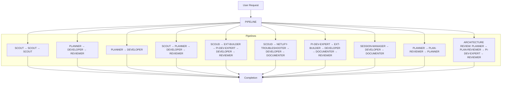
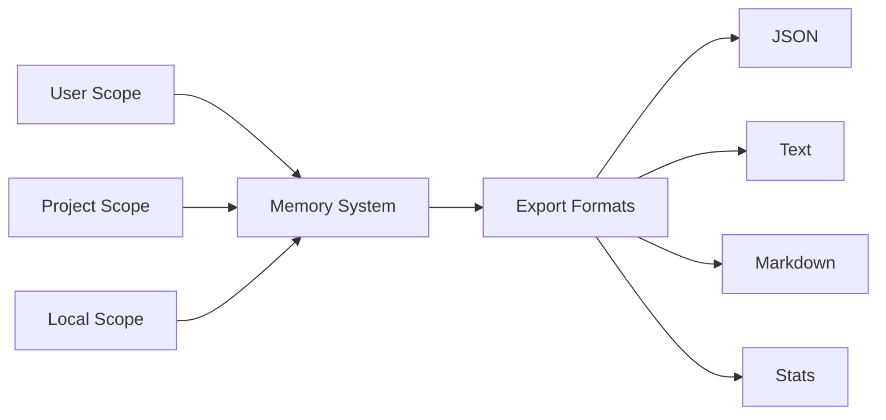
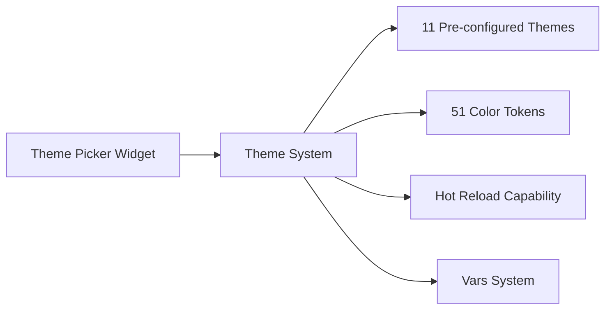

# 🚀 PIP - Pi Agent Platform Harness

⚡ **Local-First AI** | 🔒 **Privacy-First** | 🏠 **No Cloud Dependencies** | 💾 **Self-Contained** | 🌐 **Multi-Host Ready**

> **PIP** extends the Pi Agent system with enhanced orchestration, damage control, and production-ready capabilities. Think of PIP as the professional harness that makes the Pi agent system even more powerful and production-ready.

---

## 📖 Introduction

**PIP (Pi-Integration Platform)** is a modular agent-based system that sits on top of the core Pi Agent infrastructure, providing:

- **Enhanced Orchestration** → Multi-agent coordination with intelligent task distribution
- **Damage Control** → 60+ safety rules preventing catastrophic errors
- **Theme System** → 11 pre-configured themes with hot reload
- **Memory Management** → Multi-scope memory with export capabilities
- **Extension Architecture** → Three-layer module system for custom functionality

```
┌─────────────────────────────────────────────────────────────────────┐
│                              PIP System                              │
├─────────────────────────────────────────────────────────────────────┤
│  🎯  PIP Layer (Extension Harness)                                   │
│      ├─> Damage Control (Safety & Auditing)                         │
│      ├─> Memory System (Multi-scope memory)                         │
│      ├─> Theme System (11 themes, hot reload)                       │
│      └─> Extension Loader (Dynamic module loading)                   │
├─────────────────────────────────────────────────────────────────────┤
│  🤖  Pi Agent Core                                                   │
│      ├─> 30+ Specialized Agents                                      │
│      ├─> 13 Team Configurations                                      │
│      └─> 14 Pipeline Chains                                          │
├─────────────────────────────────────────────────────────────────────┤
│  🛠️  Tool Layer (Built-in Tools)                                    │
│      ├─> read/write/edit/bash/grep/find/ls                          │
│      ├─> web_search/fetch_content (External)                        │
│      └─> dispatch_agent (Agent coordination)                        │
└─────────────────────────────────────────────────────────────────────┘
```

---

## 🏗️ System Architecture

### High-Level Overview

```
┌─────────────────────────────────────────────────────────────────────┐
│                          PIP System                                  │
├─────────────────────────────────────────────────────────────────────┤
│                                                                      │
│  ┌────────────────┐    ┌────────────────┐    ┌────────────────┐   │
│  │   Entry Layer  │───>│   Middle Layer │───>│   Agent Layer  │   │
│  │                │    │                │    │                 │   │
│  │ justfile       │    │ Extensions     │    │ 30+ Agents     │   │
│  │ (Build & Launch)│    │  & Utils      │    │  + YAML Configs │   │
│  └────────────────┘    │  & Loading     │    └────────────────┘   │
│      │                 │                │                           │
│      ▼                 ▼                ▼                           │
│  ┌────────────────┐    ┌────────────────┐    ┌────────────────┐   │
│  │  PI_STACK      │    │ pi-loader.ts   │    │ agents.yaml    │   │
│  │ Environment     │    │ Dynamic Loader │    │ Teams.yaml     │   │
│  └────────────────┘    └────────────────┘    └────────────────┘   │
│                                                                      │
│  ┌──────────────────────────────────────────────────────────┐      │
│  │                    Tools Layer                            │      │
│  │  ┌──────────┐ ┌──────────┐  ┌──────────┐ ┌──────────┐  │      │
│  │  │ read     │ │ write    │  │ bash     │ │ web_search│  │      │
│  │  └──────────┘ └──────────┘  └──────────┘ └──────────┘  │      │
│  └──────────────────────────────────────────────────────────┘      │
│                                                                      │
└─────────────────────────────────────────────────────────────────────┘
```

### Core Components

| Component | Purpose | Implementation |
|-----------|---------|----------------|
| **justfile** | Build automation & launcher | POSIX-compatible shell script |
| **PI_STACK** | Environment variable | Set on first run, persists |
| **pi-loader.ts** | Dynamic extension loader | TypeScript runtime loader |
| **Damage Control** | Safety auditing | 60+ pattern rules |
| **Memory System** | Multi-scope memory | JSON/Markdovn export |
| **Theme System** | UI theming | 51 color tokens |

---

## 🤖 Agent Ecosystem

### Agent Categories

```mermaid
graph TD
    A[PIP System] --> B[Core Dev Agents]
    A --> C[Domain Specialists]
    A --> D[Platform Experts]
    A --> E[Homepage Team]
    A --> F[Meta Experts Pi-Pi]
    A --> G[Special Agents 40+]

    B --> B1[Scout - Reconnaissance]
    B --> B2[Planner - Architecture]
    B --> B3[Developer - Code]
    B --> B4[Reviewer - QC]
    B --> B5[Documenter - Docs]
    B --> B6[Red-Team - Security]
    B --> B7[Session-Manager - Coordination]

    C --> C1[FrontendCoder - UI/UX]
    C --> C2[Bowser - Browser Automation]
    C --> C3[Ext-Builder - Extensions]
    C --> C4[Plan-Reviewer - Critique]

    D --> D1[Netlify-Troubleshooter]
    D --> D2[Pi-Dev-Expert]

    E --> E1[Dev-Agent]
    E --> E2[Content-Agent]
    E --> E3[Marketing-Agent]
    E --> E4[Research-Agent]
    E --> E5[Design-Agent]
    E --> E6[SEO-Agent]
    E --> E7[Accessibility-Agent]
    E --> E8[Image-Agent]

    F --> F1[Pi-Orchestrator]
    F --> F2[Skill-Expert]
    F --> F3[Agent-Expert]
    F --> F4[Ext-Expert]
    F --> F5[TUI-Expert]
    F --> F6[CLI-Expert]
    F --> F7[Config-Expert]

    G --> G1[Research & Analysis 8]
    G --> G2[Web Tools 8]
    G --> G3[Content Creation 12]
    G --> G4[Creative AI 6]
    G --> G5[Finance 5]
    G --> G6[Developer Tools 4]
```



### All Available Agents

#### Core Development Agents (7)

| Agent | Specialization | Tools | Primary Use Case |
|-------|----------------|-------|------------------|
| **scout** | Fast Reconnaissance | read, grep, find, ls | Codebase exploration, discovery |
| **planner** | Architecture & Planning | read, grep, find, ls, write | Architecture design, resource allocation |
| **developer** | Code Implementation | read, write, edit, bash, grep, find, ls | Code generation, feature implementation |
| **reviewer** | Code Review & QC | read, bash, grep, find, ls, write | Quality checks, security audits, validation |
| **documenter** | Documentation | read, write, edit, grep, find, ls | README generation, doc updates, changelog |
| **red-team** | Security Testing | read, bash, grep, find, ls | Adversarial testing, vulnerability scanning |
| **session-manager** | Session Coordination | read, write, grep, find, ls | Chat sessions, metadata, history coordination |

#### Domain Specialists (4)

| Agent | Specialization | Tools | Primary Use Case |
|-------|----------------|-------|------------------|
| **frontendcoder** | UI/UX Implementation | read, write, edit, bash, grep, find, ls | Components, styling, responsive design |
| **bowser** | Browser Automation | read, write, ls | Playwright CLI, headless browser control |
| **ext-builder** | Extensions Development | read, write, edit, bash, grep, find, ls | Pi extensions, tools, events, rendering |
| **plan-reviewer** | Plan Critique | read, grep, find, ls | Challenges, validates implementation plans |

#### Platform Experts (2)

| Agent | Specialization | Tools | Primary Use Case |
|-------|----------------|-------|------------------|
| **netlify-troubleshooter** | CI/CD & Netlify | read, write, edit, bash, grep, find, ls | Build pipelines, dependency resolution |
| **pi-dev-expert** | Pi Ecosystem | read, write, edit, bash, grep, find, ls | Core primitives, extensions, skills, terminal |

---

## 🎯 Team Structure

### Project Teams (10)

```mermaid
graph LR
    A[Full Dev Team] --> A1[Scout - Fast Recon]
    A --> A2[Planner - Architecture]
    A --> A3[Developer - Code]
    A --> A4[Reviewer - QC]
    A --> A5[Documenter - Docs]

    B[Planning Review Team] --> B1[Scout]
    B --> B2[Planner]
    B --> B3[Plan-Reviewer]
    B --> B4[Reviewer]

    C[Security Research Team] --> C1[Scout]
    C --> C2[Developer]
    C --> C3[Netlify-Troubleshooter]
    C --> C4[Ext-Builder]
    C --> C5[Pi-Dev-Expert]

    D[Browser Automation Team] --> D1[Scout]
    D --> D2[Developer]
    D --> D3[Bowser]
    D --> D4[Documenter]

    E[Session Team] --> E1[Session-Manager]
    E --> E2[Developer]
    E --> E3[Documenter]

    F[Build Deploy Team] --> F1[Developer]
    F --> F2[Netlify-Troubleshooter]
    F --> F3[Planner]
    F --> F4[Reviewer]

    G[Architecture Team] --> G1[Planner]
    G --> G2[Plan-Reviewer]
    G --> G3[Reviewer]
    G --> G4[Ext-Builder]
    G --> G5[Pi-Dev-Expert]

    H[Extensions Team] --> H1[Ext-Builder]
    H --> H2[Developer]
    H --> H3[Documenter]
    H --> H4[Pi-Dev-Expert]

    I[Fast Exec Team] --> I1[Planner]
    I --> I2[Developer]
    I --> I3[Scout]

    J[Maintenance Team] --> J1[Documenter]
    J --> J2[Session-Manager]
    J --> J3[Developer]
    J --> J4[Reviewer]
```



### Team YAML Structure

#### teams.yaml Format

```yaml
# Example team configuration
- team: full-dev-team
  members:
    - scout
    - planner
    - developer
    - reviewer
    - documenter
  default: true
  purpose: Complete development lifecycle implementation

- team: security-research-team
  members:
    - scout
    - developer
    - netlify-troubleshooter
    - ext-builder
    - pi-dev-expert
  default: false
  purpose: Deep exploration and security analysis

- team: browser-automation-team
  members:
    - bowlser
    - developer
    - documenter
  default: false
  purpose: Web scraping and browser automation
```

### Team Selection

```bash
# Use agent-team extension to switch teams
pi -e agent-team
just run-pi "agent-team, full-dev-team"

# View available teams
pi --teams
```

---

## 🔄 Pipeline Chains

### Available Pipeline Workflows



### Chain Descriptions

| Chain | Steps | Purpose |
|-------|-------|---------|
| **plan-build-review** | planner → developer → reviewer | Standard development cycle with review |
| **plan-build** | planner → developer | Fast two-step without review |
| **scout-flow** | scout → scout → scout | Triple-scout deep reconnaissance |
| **plan-review-plan** | planner → plan-reviewer → planner | Iterative planning with critique |
| **full-review** | scout → planner → developer → reviewer | Complete end-to-end pipeline |
| **browser-flow** | scout → developer → bowser → documenter | Browser automation workflow |
| **session-workflow** | session-manager → developer → documenter | Session management operations |
| **security-research-flow** | scout → ext-builder → pi-dev-expert → developer → reviewer | Security research |
| **deploy-workflow** | scout → netlify-troubleshooter → developer → documenter | CI/CD deployment |
| **extensions-workflow** | pi-dev-expert → ext-builder → developer → documenter → reviewer | Extension development |
| **fast-exec-team** | planner → developer | Quick cycles |
| **docs-workflow** | scout → documenter → developer | Documentation workflow |
| **architecture-review** | planner → plan-reviewer → pi-dev-expert → reviewer | Architecture review |
| **session-analysis-flow** | session-manager | Session deep-dive analysis |

---

## ✨ Key Features

### 🛡️ Damage Control

```
┌─────────────────────────────────────────┐
│      Damage Control System               │
│                                         │
│  ✅ 60+ Dangerous Command Patterns      │
│  ✅ Read-Only/No-Delete Path Protection │
│  ✅ Per-Path Override Mechanisms        │
│  ✅ Interactive Settings Modal          │
│  ✅ Real-time Safety Auditing           │
└─────────────────────────────────────────┘
```

#### Safety Rules Examples

```bash
# Dangerous command patterns blocked
❌ rm -rf /
❌ curl | bash
❌ wget | bash
❌ dd if=/dev/zero of=/dev/sdX

# Protected directories
📂 ~/.pi/user_data (read-only)
📂 ~/.pi/project (read-only)
📂 /etc/* (no writes)

# Customizable via settings
$ {EDITOR} {settings} --damage-control
```

### 🧠 Memory System

Multi-scope memory for context retention:



#### Memory Commands

```bash
# Memory operations
pi memory --list
pi memory --export json
pi memory --export markdown
pi memory --stats
```

### 🎨 Theme System



#### Available Themes

| Theme | Description | Status |
|-------|-------------|--------|
| **catppuccin** | Modern pastel colors | ✅ Dark/Light |
| **nord** | Arctic blue palette | ✅ Dark |
| **dracula** | Classic dev theme | ✅ Dark |
| **tokyonight** | Tokyo-inspired | ✅ Dark |
| **monokai** | Classic IDE colors | ✅ Dark |
| **gruvbox** | Warm earth tones | ✅ Dark |
| **papermoon** | Soft pink palette | ✅ Dark |
| **solarized** | Gray-green balance | ✅ Light/Dark |
| **one-dark** | VS Code default | ✅ Dark |
| **material** | Material design | ✅ Dark/Light |
| **gruvbox-material** | Gruvbox variant | ✅ Dark |

---

## 📚 Usage Patterns

### Installation

```bash
git clone https://github.com/zerwiz/pip.git
cd pip
just install

# Or direct run
just run-pi "agent-team, damage-control"
```

### Running PIP

```bash
# Standard usage
just run-pi "agent-team"

# With specific extensions
just run-pi "agent-team, damage-control, theme-cycler"

# Multi-host (optional)
just run-pi "agent-team,damage-control" --hosts local,remote1,remote2
```

### Command Reference

```bash
# Common commands
pi <request>                 # Send request to agent team
pi memory --list            # List memory scopes
pi memory --export          # Export memory files
pi --teams                   # View available teams
pi --pipelines              # View available pipelines
pi --settings               # View current settings
pi --themes                 # List available themes
pi --help                   # Full help menu
```

### Team Switching

```bash
# Switch teams
pi -e agent-team
just run-pi "agent-team, new-team"

# List all teams
pi --teams --list
```

---

## 🎓 Best Practices

### ✅ Recommended Practices

1. **Start with Scout** → Always run `scout` first for reconnaissance
2. **Use Teams** → Let teams handle task distribution
3. **Enable Damage Control** → Default: enabled, prevents errors
4. **Export Memory** → Regular memory exports for backup
5. **Use Pipelines** → Leverage built-in pipeline chains
6. **Check Settings** → Review `$settings` before task

### ⚠️ What to Avoid

1. **Don't Skip Scout** → Always recon before execution
2. **Avoid Direct File Deletion** → Use edit/write, not bash rm
3. **Don't Overload** → One team at a time per session
4. **Review Code** → Always review after developer step
5. **Backup Memory** → Export memory regularly

### 📊 Performance Tips

```bash
# Enable parallel execution
just run-pi "agent-team" --parallel

# Use fast-team for simple tasks
just run-pi "fast-exec-team"

# Multi-host for heavy workloads
just run-pi "agent-team" --hosts local,host1,host2
```

---

## 💡 Examples

### Example 1: Build a Webpage

```bash
# Homepage team creates complete website
just run-pi "homepage-team" \
  --request "Create a landing page for my product"

# Behind the scenes:
# - design-agent creates UI
# - content-agent writes copy
# - dev-agent implements code
# - image-agent selects visuals
```

### Example 2: Security Research

```bash
# Security research workflow
just run-pi "security-research-team" \
  --request "Analyze this codebase for vulnerabilities"

# Flow: scout → ext-builder → pi-dev-expert → developer → reviewer
```

### Example 3: Extension Development

```bash
# Build a custom extension
just run-pi "extensions-team" \
  --request "Create a memory export extension"

# Flow: pi-dev-expert → ext-builder → developer → documenter → reviewer
```

### Example 4: Browser Automation

```bash
# Web scraping workflow
just run-pi "browser-automation-team" \
  --request "Extract product data from this website"

# Flow: scout → developer → bowser → documenter
```

---

## 📁 Project Structure

```
pip/
├── justfile                 # Entry point & launcher
├── .pi/
│   ├── agents/             # Agent definitions
│   ├── extensions/         # Pi extensions
│   └── py/                 # Python components
├── .pi/build_logs/         # Build artifacts
├── .pi/reference/          # File backups
└── README.md               # This file
```

### Key Files

| File | Purpose |
|------|---------|
| **justfile** | Entry point, sets PI_STACK, launches extensions |
| **.pi/agents/** | 30+ agent definitions |
| **.pi/extensions/** | 24+ extension modules |
| **.pi/build_logs/** | Build artifacts and logs |
| **.pi/reference/** | Full-file backups |

---

## 🔗 Related Documentation

- [Pi Agent System Documentation](.pi/py/pi-agent-system-documentation.md)
- [Agent YAML Configuration Guide](docs/AGENT-YAML-CONFIGURATION.md)
- [Extensions Documentation](extensions/README.md)
- [Migration Guide](docs/MIGRATION-GUIDE.md)
- [Justfile Startup Mechanism](docs/JUSTFILE-STARTUP-MECHANISM.md)

---

## 🤝 Contributing

```bash
# 1. Fork the repository
git clone https://github.com/zerwiz/pip.git

# 2. Create a new branch
git checkout -b feature/my-feature

# 3. Make changes
pi [your-request]

# 4. Test locally
just install
just run-pi "agent-team"

# 5. Submit a pull request
git push origin feature/my-feature
```

---

## 📋 License

MIT License — See LICENSE file for details

---

## 📞 Support

- **Issues**: Create on GitHub
- **Features**: Submit via issue tracker
- **FAQ**: Check README frequently

---

## 🙏 Acknowledgments

Built with ❤️ by the PIP team.
Thanks to Pi agent system for the amazing foundation.

**🚀 Ready to get started?**
```bash
just run-pi "agent-team, damage-control"
```

---

**System Version**: 0.72.1+  
**Last Updated**: 2026  
**License**: MIT  
**Developer**: @zerwiz
