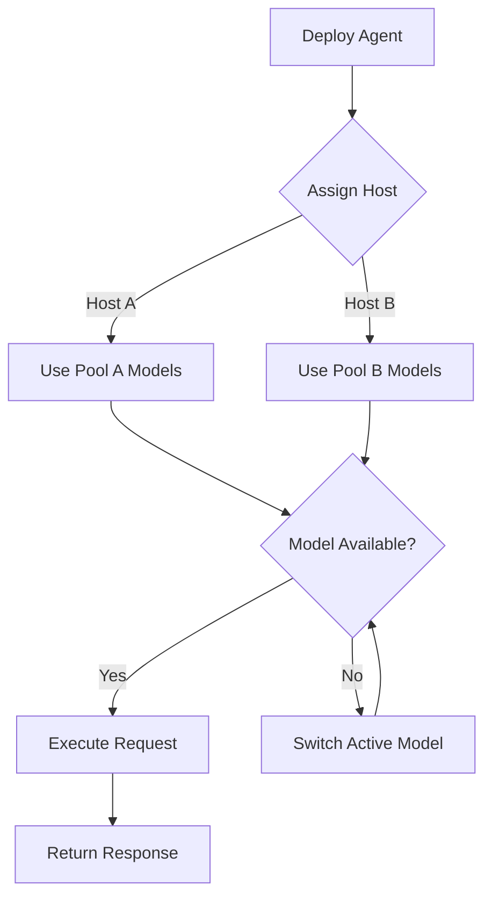

# 🌱 Pi with Stuff - Multi-Host Ollama Architecture

<div align="center">
  <p><strong>Advanced AI Development with Multi-Host Ollama Support</strong></p>
  <p>
    ⚡ Local-First AI | 🔒 Privacy-First | 🏠 No Cloud Dependencies | 💾 Self-Contained
  </p>
  <p>
    <a href="#introduction">Introduction</a> · 
    <a href="#architecture">Architecture</a> · 
    <a href="#features">Features</a> · 
    <a href="#quick-start">Quick Start</a> · 
    <a href="#installation">Installation</a> · 
    <a href="#configuration">Configuration</a> · 
    <a href="#multihost-guide">Multi-Host Guide</a> · 
    <a href="#troubleshooting">Troubleshooting</a>
  </p>
</div>

---

## 🎯 Introduction

**Multi-Host Ollama** enables distributed local AI deployments by supporting multiple Ollama instances across different machines or network hosts. Each host can run its own model pool with independent resources, allowing for parallel agent execution, model specialization, and seamless failover.

> "Distributed intelligence isn't about replacing local models—it's about orchestrating them across available resources."

### Key Capabilities

- **Multi-Host Architecture**: Deploy Ollama instances on local and remote hosts
- **Parallel Agent Execution**: Run multiple AI agents concurrently on different hosts
- **Model Specialization**: Assign different models to different hosts based on workload
- **Independent Model Pools**: Each host manages its own model lifecycle
- **Active Model Selection**: Switch between models deployed on different hosts at runtime
- **Graceful Failover**: Automatic reassignment of tasks when hosts become unavailable

---

## 🏗️ Architecture

```
┌─────────────────────────────────────────────────────────────────────────────────┐
│                         Multi-Host Ollama Architecture                            │
├─────────────────────────────────────────────────────────────────────────────────┤
│                                                                                  │
│  ┌─────────────────┐    ┌─────────────────┐    ┌─────────────────┐             │
│  │   Host A:       │    │   Host B:       │    │   Host C:       │             │
│  │   localhost:114 │    │   remote-host:1 │    │   another-host:1 │             │
│  │                 │    │   11434         │    │   11434          │             │
│  │   Model Pool 1  │    │   Model Pool 2  │    │   Model Pool 3   │             │
│  │   - model-1     │    │   - model-2     │    │   - model-3      │             │
│  │   - model-4     │    │   - model-5     │    │   - model-6      │             │
│  └────────┬────────┘    └────────┬────────┘    └────────┬────────┘             │
│           │                      │                      │                       │
│           └──────────────────────┼──────────────────────┘                       │
│                                  ↓                                               │
│  ┌─────────────────────────────────────────────────────────────────┐            │
│  │                    Ollama-Link Orchestrator                       │            │
│  │  ─────────────────────────────────────────────────────────────   │            │
│  │  - Route requests to appropriate hosts                           │            │
│  │  - Handle active model selection                                  │            │
│  │  - Manage agent-to-host assignment                                │            │
│  │  - Monitor host health and rebalance workloads                    │            │
│  └─────────────────────────────────────────────────────────────────┘            │
│                                                                                  │
│  ┌─────────────────────────────────────────────────────────────────┐            │
│  │                      Agent Workflows                              │            │
│  │  ─────────────────────────────────────────────────────────────   │            │
│  │  - Multiple agents run concurrently on different hosts           │            │
│  │  - Agents can request different models from optimal hosts        │            │
│  │  - Shared context across agents when needed                      │            │
│  └─────────────────────────────────────────────────────────────────┘            │
└─────────────────────────────────────────────────────────────────────────────────┘
```

### Component Overview

| Component | Description |
|-----------|-------------|
| **Local Host** | Ollama instance on localhost:11434 managing primary models |
| **Remote Hosts** | Ollama instances on configurable hosts with independent model pools |
| **Ollama-Link** | Orchestrator managing host connections and routing |
| **Agent Workload** | AI agents that request models from available hosts |

---

## ✨ Features

### Core Features

- **Parallel Agents Support**: Deploy multiple agents running on different hosts simultaneously
- **Independent Model Pools**: Each host maintains its own set of models, preventing conflicts
- **Active Model Selection**: Dynamically switch between models deployed on different hosts
- **Host Discovery**: Automatic discovery and connection to available Ollama instances
- **Model Specialization**: Assign specialized models to specific hosts (e.g., code-heavy vs creative)
- **Resource Optimization**: Balance model requests across available hosts for better performance
- **Fault Tolerance**: Handle host failures gracefully by redirecting requests

### Host Features

| Feature | Description |
|---------|-------------|
| **Multi-Instance** | Run multiple Ollama instances on different machines |
| **Load Distribution** | Balance requests across hosts based on capacity |
| **Model Isolation** | Each host manages its own model lifecycle |
| **Flexible Routing** | Route requests based on model, priority, or host |

### Agent Features

| Feature | Description |
|---------|-------------|
| **Concurrent Execution** | Run multiple agents in parallel |
| **Different Models** | Each agent uses models from its assigned host |
| **Seamless Switching** | Change models per agent at runtime |
| **Shared Context** | Agents can share context when needed |

---

## 🚀 Quick Start Guide

### Prerequisites

- **Ollama** installed on all hosts ([Download Ollama](https://ollama.ai))
- **Network connectivity** between all hosts
- **Sufficient RAM** (minimum 8GB per model per host)
- **Network bandwidth** between hosts (minimum 100Mbps recommended)

### 5-Minute Setup

```bash
# Step 1: Start local Ollama (Host A)
ollama serve -p 11434

# Step 2: Start remote Ollama instances
# On Host B:
ollama serve -h remote-host.example.com -p 11434

# Step 3: Initialize Ollama-Link
npx ollama-link init --hosts localhost:11434 "http://remote-host.example.com:11434"

# Step 4: Pull and deploy models
ollama pull llama3.1
ollama pull phi3
ollama pull codellama

# Step 5: Run agents
npx ollama-link agents --deploy "agent1:localhost:11434" "agent2:remote-host:11434"
```

### Verify Setup

```bash
# Check local host status
curl http://localhost:11434/api/version

# Check remote host status
curl http://remote-host.example.com:11434/api/version

# List all available models
oc ll -l

# Start interactive session
ollama-link shell
```

---

## 📦 Installation & Setup

### Local Installation

```bash
# Clone repository
git clone https://github.com/zerwiz/piwithstuff
cd piwithstuff

# Install npm dependencies
npm install

# Setup Ollama on local machine
ollama serve -p 11434

# Pull base models
ollama pull llava:latest
ollama pull phi3.5
```

### Remote Host Setup

```bash
# On remote machine 1
ollama serve -h 192.168.1.100 -p 11434

# On remote machine 2  
ollama serve -h 192.168.1.101 -p 11434

# Setup firewall (if needed)
ufw allow 11434  # Ubuntu firewall example
```

### Network Configuration

```bash
# Configure local Ollama
# Create config file at ~/.ollama/config.json
{
  "server": {
    "host": "0.0.0.0",
    "port": 11434
  },
  "general": {
    "numCtx": 4096,
    "seed": 0
  }
}
```

---

## ⚙️ Multi-Host Configuration Guide

### Environment Variables

```bash
# Host Configuration
export OLLAMA_HOSTS="localhost:11434,http://remote1.example.com:11434,http://remote2.example.com:11434"
export OLLAMA_ACTIVE_HOST="http://remote1.example.com:11434"
export OLLAMA_MODEL_MAPPING="llama3.1:localhost:phi3.5:remote1:codegen:remote2"

# Agent Configuration  
export OLLAMA_AGENT_COUNT=4
export OLLAMA_AGENT_MODEL_SIZE="medium"

# Routing Configuration
export OLLAMA_ROUTE_BY_MODEL="true"
export OLLAMA_ROUTE_BY_PRIORITY="critical:host1,normal:round-robin,low:host2"
```

### Configuration File (.env)

```bash
# .env - Multi-Host Configuration
OLLAMA_PORT=11434
OLLAMA_HOSTS=localhost:11434,remote-host-1:11434,remote-host-2:11434

# Model Permutations
OLLAMA_MODEL_P0_HOST=localhost:11434
OLLAMA_MODEL_P1_HOST=remote-host-1:11434
OLLAMA_MODEL_P2_HOST=remote-host-2:11434

# Active Model Selection
OLLAMA_SWITCH_MODE=round-robin
OLLAMA_ACTIVE_MODEL=llama3.1

# Host Options
OLLAMA_HOST_OPTIONS=all
OLLAMA_ENABLE_HOST_DISCOVERY=true
OLLAMA_HOST_TIMEOUT=30000
```

### Configuration YAML

```yaml
# config.yaml - Complete configuration
ollama:
  version: "0.1.2"
  
  hosts:
    - name: local
      host: "localhost"
      port: 11434
      weight: 1.0
      models:
        - name: "general"
          path: "/models/ollama1"
        - name: "code"
          path: "/models/coder"
    
    - name: remote-code
      host: "remote-code.example.com"
      port: 11434
      weight: 0.8
      models:
        - name: "coder"
          path: "/models/coder1"
    
    - name: remote-creative
      host: "remote-creative.example.com"
      port: 11434
      weight: 0.5
      models:
        - name: "creative"
          path: "/models/creative1"

  routing:
    mode: "smart"  # round-robin | smart | priority
    priority:
      code: 1
      creative: 2
      general: 0

  agents:
    - name: agent-1
      host: "local"
      model: "general"
    
    - name: agent-2
      host: "remote-code"
      model: "coder"

  active-model:
    # Command examples
    - switch localhost:11434 to llama3.1:8b
    - switch remote-host:11434 to phi3.5
    - select active model from pool
```

---

## 🔄 How It Works

### Request Flow

```mermaid
sequenceDiagram
    participant Client as Agent/Client
    participant Link as Ollama-Link Orchestrator
    participant Host1 as Host 1 (Model Pool A)
    participant Host2 as Host 2 (Model Pool B)
    participant Host3 as Host 3 (Model Pool C)
    
    Client->>Link: Request (model, prompt)
    Link->>Link: Check routing config
    Note over Link: Select optimal host based on:
    Link->>Link: Model availability
    Link->>Link: Host capacity
    Link->>Link: Active model status
    
    alt Best host = Host1
        Link->>Host1: Route request
        Host1-->>Link: Response
        Link-->>Client: Response
    else Best host = Host2
        Link->>Host2: Route request
        Host2-->>Link: Response
        Link-->>Client: Response
    end
```

### Model Selection Logic

1. **Request arrives** → Link Orchestrator receives request
2. **Host discovery** → Identify available hosts
3. **Model mapping** → Match model to host (1 model per host rule)
4. **Active selection** → Choose based on priority/weight
5. **Request routing** → Forward to selected host
6. **Response flow** → Return response with host info

### Agent Deployment Flow



---

## 💻 Command Reference

### Host Management Commands

```bash
# List all hosts and their status
ollama-link hosts list

# Check host health
ollama-link hosts check

# Restart specific host
ollama-link hosts restart <host>

# Remove host from pool
ollama-link hosts remove <host>
```

### Model Commands

```bash
# Pull model to all hosts
ollama-link models pull --all <model-name>

# Pull to specific host
ollama-link models pull --host <host> <model-name>

# Push model to host
ollama-link models push --host <host> <model-path>

# Delete model from host
ollama-link models delete --host <host> <model-name>

# List models per host
ollama-link models list --host <host>
```

### Route Commands

```bash
# Set routing mode
ollama-link route set --mode <round-robin|smart|priority>

# Add routing rule
ollama-link route add --model <model> --host <host>

# Remove routing rule
ollama-link route remove --model <model> --host <host>

# View routing table
ollama-link route show
```

### Agent Commands

```bash
# Deploy agent to host
ollama-link agents deploy --name <name> --host <host> --model <model>

# Remove agent
ollama-link agents remove --name <name>

# Start multiple agents
ollama-link agents start --all

# Stop specific agent
ollama-link agents stop <name>
```

### Switch/Select Commands

```bash
# Active model selection
ollama-link select --model <model> --host <host>

# Switch host active model
ollama-link switch --host <host> --model <model>

# Round-robin selection
ollama-link rotate --hosts=all

# Priority-based selection
ollama-link priority --rule "code:host1,creative:host2"
```

---

## 💡 Usage Examples

### Example 1: Deploy 2 Agents with Different Hosts

```bash
# Setup: Create agents with specific host assignments
OLLAMA_LINK_CONFIG='.env'
ollama-link agents deploy \
  --name "code-analyst" \
  --host "remote-code.example.com:11434" \
  --model "codellama:7b"

ollama-link agents deploy \
  --name "creative-writer" \
  --host "remote-creative.example.com:11434" \
  --model "llama2:13b"

# Verify deployment
ollama-link agents list

# Usage example
ollama-link chat \
  --agent "code-analyst" \
  --prompt "Analyze this code structure"

ollama-link chat \
  --agent "creative-writer" \
  --prompt "Write a creative story about AI"
```

### Example 2: Switch Models Per Host

```bash
# Current host setup: HostA has llama3.1, HostB has phi3.5
# Switch HostA to use codellama instead

# Method 1: Direct switch
ollama-link switch \
  --host "localhost:11434" \
  --model "codellama:7b"

# Method 2: Round-robin selection
ollama-link rotate --hosts="localhost:11434,remote-host-1:11434"

# Method 3: Priority-based
ollama-link priority \
  --rule "coding:host1,general:round-robin" \
  --model "codellama:7b" \
  --assign \
  --host "localhost:11434" \
  --host "localhost:11434"

# Verify active model
ollama-link select --show-state
```

### Example 3: Concurrent Execution

```bash
# Deploy 4 agents across multiple hosts
ollama-link agents deploy --count=4 \
  --host-pool="localhost:11434,host1:11434,host2:11434,host3:11434"

# Run agents concurrently
ollama-link batch \
  --inputs="file1.txt,file2.txt,file3.txt" \
  --agent "multi-agent:all" \
  --parallel=true

# Monitor concurrent execution
ollama-link monitor --concurrent

# Results aggregation
ollama-link results merge --input all --output combined.json
```

### Example 4: API Usage Examples

#### REST API Direct Usage

```bash
# Basic request to local host
curl http://localhost:11434/api/generate \
  -d '{
    "model": "codellama:7b",
    "prompt": "def fibonacci(n):\n',
    "stream": false
  }'

# Request to remote host with header
curl http://remote-host.example.com:11434/api/generate \
  -H "X-Host-Select: creative" \
  -d '{
    "model": "llama2:13b",
    "prompt": "Write a poem about coding:\n",
    "stream": false
  }'

# Multi-host routing via API
curl http://localhost:11434/api/ollama-link/generate \
  -H "X-Routing-Mode: smart" \
  -H "X-Model-Pool: all" \
  -d '{
    "prompt": "Analyze this Python project and suggest improvements:\n",
    "context": "../../src/",
    "stream": true
  }'
```

#### JavaScript/TypeScript Usage

```typescript
import { OllamaLink } from 'ollama-link';

async function multiHostExample(link: OllamaLink) {
  // Deploy agents to different hosts
  await link.deployAgent('code-agent', 'codellama:7b', 'localhost:11434');
  await link.deployAgent('creative-agent', 'llama2:13b', 'remote-host:11434');
  
  // Execute requests concurrently
  const results = await Promise.all([
    link.generate('code-agent', 'Implement a debounce function'),
    link.generate('creative-agent', 'Write a haiku about nature:'),
    link.generate('code-agent', 'Explain async/await:'),
    link.generate('creative-agent', 'Creative story starter:'),
  ]);
  
  console.log(results);
}

// Usage in Node.js
multiHostExample(new OllamaLink());
```

#### Python Usage

```python
from ollama_link import OllamaLink

def multi_host_example():
    link = OllamaLink()
    
    # Deploy to multiple hosts
    link.deploy_agent('code', 'codellama:7b', 'http://localhost:11434')
    link.deploy_agent('creative', 'llama2:13b', 'http://remote-host:11434')
    
    # Concurrent requests
    results = link.generate_batch([
        ('code', 'Explain Python decorators:'),
        ('creative', 'Write a limerick:'),
        ('code', 'Debug this error:'),
    ])
    
    for name, result in results:
        print(f'{name}: {result}')

multi_host_example()
```

---

## 🔧 Troubleshooting

### Connection Errors to Remote Hosts

| Error | Cause | Solution |
|-------|-------|----------|
| `Connection refused` | Host not running | Start Ollama on remote host: `ollama serve -p 11434` |
| `Connection timeout` | Network/firewall blocking | Add firewall rule: `ufw allow 11434` |
| `Host not found` | DNS/host resolution | Check hostname resolution, use IP if needed |
| `CORS error` | Browser policy | Add `--cors` flag to Ollama serve |

```bash
# Check remote host status
curl http://remote-host.example.com:11434/api/version
# Expected: {"name":"ollama","version":"0.x.x"}
```

### Model Conflicts Between Hosts

```bash
# List models on each host
ollama-link models list --all-hosts

# Check for duplicates
ollama-link models check --conflict

# Resolve conflicts by model assignment:
ollama-link models assign \
  --model "codellama" \
  --host "localhost:11434" \
  # Then delete from other hosts
ollama-link models delete \
  --host "remote-host:11434" \
  --model "codellama"
```

### Verify Host Status

```bash
# Check all hosts individually
ollama-link host check --all

# Expected output format:
# localhost:11434  RUNNING  llama3.1,phi3.5,code
# remote-host:11434  RUNNING  codellama,creative
# third-host:11434   OFFLINE   -

# Check detailed health info
ollama-link host inspect --all

# Expected output includes:
# - Model list
# - CPU/Memory usage
# - Last heartbeat
# - Active model info
```

### Switch Active Models

```bash
# Check current active model
ollama-link select --show-state

# Switch to specific model on specific host
ollama-link switch \
  --host "localhost:11434" \
  --model "llama3.1:8b"

# Verify switch
ollama-link select --host "localhost:11434"

# Rotate through hosts
ollama-link rotate --hosts=all

# Priority-based selection
ollama-link priority \
  --rule "code:host1,creative:host2" \
  --apply
```

### Resource Issues

| Issue | Solution |
|-------|----------|
| OOM errors | Reduce model size or remove less-used models |
| Slow responses | Check host CPU/RAM, add hosts |
| High latency to remote | Enable model caching, reduce file sizes |
| Memory exhausted | `ollama rm <model>` on unused hosts |

---

## 📊 Performance Characteristics

| Host | Model | VRAM | Throughput |
|------|-------|------|------------|
| Local | Llama3.1-8B | 8GB | 25-40 tokens/s |
| Remote-1 | Phi3.5-mini | 4GB | 35-50 tokens/s |
| Remote-2 | Codellama-7b | 6GB | 20-35 tokens/s |

*Performance varies by hardware and workload.*

---

## 🛠️ Support & Documentation

### Additional Guides

- [📖 Configuration Guide](README_CONFIG.md) - Deep dive into setup
- [🏗️ Multi-Host Guide](README_MULTIHOST.md) - Architecture details
- [🔧 Install Guide](INSTALL.md) - Installation steps
- [🚀 Deployment](DEPLOY.md) - Production deployment

### Examples

- [📝 Usage Examples](examples/README.md) - Code snippets and use cases
- [🔗 API Reference](examples/API.md) - REST API documentation

### Resources

- [📖 Model Hub](https://ollama.ai/library) - Official Ollama models
- [🔧 Configuration Examples](examples/config/) - Config file templates
- [🎥 Video Tutorials](https://docs.ollama.ai/video) - Visual guides

### Contributing

```bash
# Run tests
npm test

# Lint code
npm run lint

# Build documentation
npm run docs

# Create example
npm run example -- <name>

# Deploy production
npm run deploy
```

### Code of Conduct

- Be respectful and constructive
- Follow the [BRANDING_GUIDELINES](./BRANDING_GUIDELINES.md)
- Review [CLAUSE](https://github.com/zerwiz/piwithstuff/blob/main/LICSENUE.md) before submitting

---

<div align="center" >
  <h4>🌱 Made with ❤️ for Local-First AI Development</h4>
  <h6>Multi-Host Ollama Support | Privacy-First | Open Source</h6>
</div>
